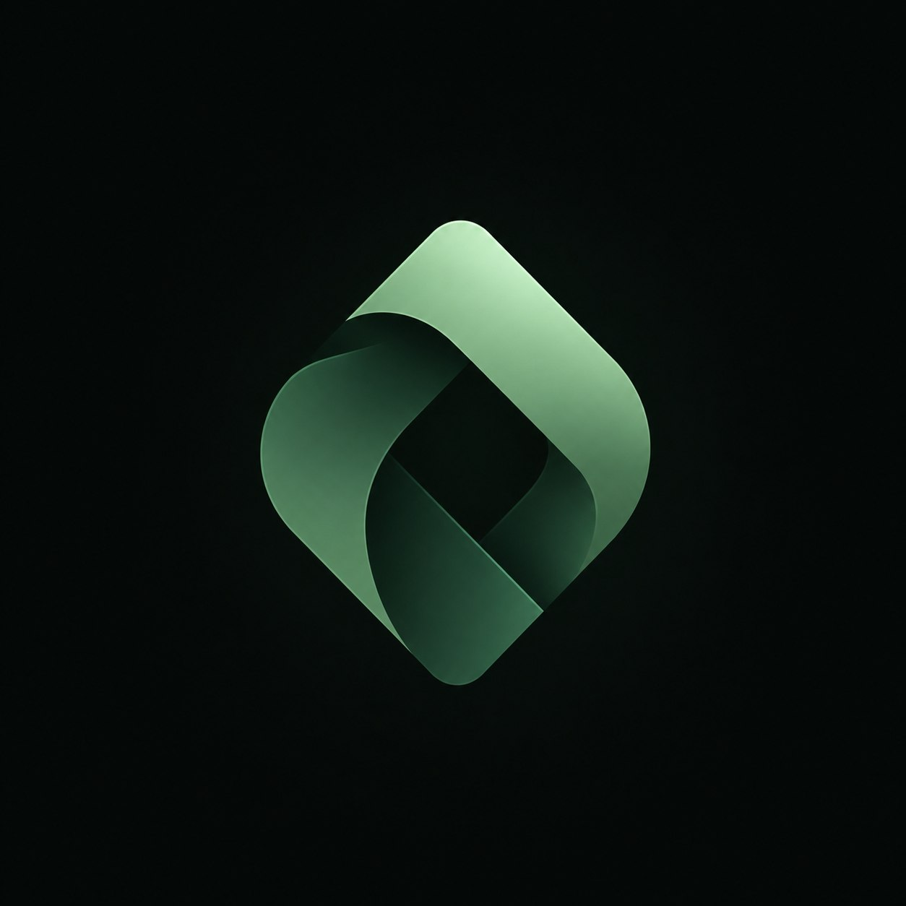

  

<h1 align="center">Arkava Protocol</h1>

  Swiss DLT Art. 973d compliant Real-World Asset (RWA) tokenization protocol for US Equities, ETFs, and Treasury Bonds backed 1:1 by Swissquote Bank SA custody on Robinhood Chain L2.

<h2 align="center">Official $AVA Token Contract</h2>

  Contract Address: <code>To Be Announced (Stage 1 Pre-Sale Active)</code>

  <a href="https://arkava.cloud">Website</a>
  &middot;
  <a href="docs.html">Documentation</a>
  &middot;
  <a href="https://github.com/arkavacloud">GitHub</a>
  &middot;
  <a href="mailto:official@arkava.cloud">Email Contact</a>
  &middot;
  <a href="https://x.com/Arkavacloud">X</a>

  
  
  
  

## Product Snapshot

Arkava Protocol enables institutional and retail Web3 investors to mint, trade, and earn yield on tokenized US equities, ETFs, and treasury assets (`aAAPL`, `aNVDA`, `aCOIN`, `aTSLA`, `aMSFT`, `aCSPX`, `aIB01`) collateralized 1:1 on Robinhood Chain Layer-2.

Underlying physical stocks and fixed-income assets are legally ring-fenced in bankruptcy-remote segregated omnibus accounts at Swissquote Bank SA in Zug, Switzerland, complying with Article 973d of the Swiss DLT Act (*Ledger-Based Securities*). On-chain asset reserves are verified in real-time every 10 minutes via Chainlink Proof-of-Reserve (PoR) oracles.

Arkava includes a built-in $AVA Pre-Sale Token Launchpad, automated compounding Yield Vaults (2.7% – 5.2% APY), real-time Web3 wallet session persistence (`arkava_db_wallet_0x...`), interactive `MAX` transaction controls, and zero-gas execution on Robinhood Chain.

## Product Surface

| Surface | What it Provides |
| --- | --- |
| Asset Explorer | Real-time market feed for tokenized stocks, ETFs, corporate bonds, and US treasuries |
| Minting & Swap Engine | 1:1 USD collateralized token minting and instant redemption terminal with `MAX` all-in controls |
| $AVA Pre-Sale Launchpad | Stage 1 $AVA token purchase at $0.0005 (vs $0.0015 listing) with 5% bonus and 5% referral credit |
| Yield Vaults | Automated yield compounding vaults delivering dividend pass-through and staking rewards |
| Web3 Wallet Persistence | Per-wallet database storage (`arkava_db_wallet_0x...`) preserving balances across browser reloads |
| Oracle Telemetry | Chainlink Proof-of-Reserve live audit telemetry verifying bank custody against token supply |
| Institutional Portal | FINMA-attested institutional onboarding and primary minting application workflow |

## What Arkava Can Do

- **Tokenize Equities 1:1**: Mint fractional tokenized shares of Apple, NVIDIA, Coinbase, Tesla, Microsoft, and S&P 500 ETFs backed 1:1 by Swissquote custody.
- **Claim Testnet Faucet**: Instantly credit $10,000.00 tUSDC to connected Web3 wallets on Robinhood Chain.
- **Execute All-In Trades**: Utilize interactive `MAX` buttons to automatically fill 100% available tUSDC cash or token holdings into order forms.
- **Participate in $AVA Pre-Sale**: Buy protocol governance $AVA tokens at $0.0005 (300% launch upside) and earn 5% referral commissions credited directly to Web3 wallets.
- **Persist Wallet State**: Save cash balances, stock holdings, and faucet claims dynamically per wallet address (`arkava_db_wallet_0x...`) without losing progress on refresh.
- **Verify Reserve Proofs**: Inspect live Chainlink PoR attestations, OpenZeppelin security audit certificates (`ARKAVA_OpenZeppelin_Audit.pdf`), and Swiss DLT legal prospectus documents.
- **Zero-Gas Settlement**: Benefit from sub-second finality and zero-gas execution on Robinhood Chain L2 (Chain ID 5050).

## Tokenized Asset Catalog

Connected users can mint, trade, and stake the following primary asset suite:

| Token Symbol | Asset Name | Underlier / ISIN | Collateral Backing | Custodian |
| --- | --- | --- | --- | --- |
| `aAAPL` | Arkava Apple Inc | Apple Inc Common Stock (US0378331005) | 100% Collateralized | Swissquote Bank SA |
| `aNVDA` | Arkava NVIDIA Corp | NVIDIA Corp Common Stock (US67066G1040) | 100% Collateralized | Swissquote Bank SA |
| `aCOIN` | Arkava Coinbase | Coinbase Global Inc (US19260Q1076) | 100% Collateralized | Swissquote Bank SA |
| `aTSLA` | Arkava Tesla Inc | Tesla Inc Common Stock (US88160R1014) | 100% Collateralized | Swissquote Bank SA |
| `aMSFT` | Arkava Microsoft | Microsoft Corp Stock (US5949181045) | 100% Collateralized | Swissquote Bank SA |
| `aCSPX` | Arkava S&P 500 ETF | iShares Core S&P 500 UCITS ETF | 100% Collateralized | Swissquote Bank SA |
| `aIB01` | Arkava US Treasuries | iShares $ Treasury Bond 0-1yr UCITS | 100% Collateralized | Swissquote Bank SA |
| `$AVA` | Arkava Protocol | Protocol Governance & Revenue Pass-Through | Native Utility | Robinhood L2 |

## $AVA Protocol Pre-Sale & Launchpad

The $AVA token is the core utility and revenue distribution token of Arkava Protocol:

- **Stage 1 Pre-Sale Price**: `$0.0005 USD` per $AVA token.
- **Expected Listing Price**: `$0.0015 USD` (3x / 300% Launch Value).
- **Early Bird Bonus**: 5% bonus tokens included automatically on all pre-sale purchases.
- **Referral Program**: 5% instant commission credited to wallet holders for all purchases made via unique referral links (`https://arkava.cloud/?ref=0x...`).
- **Revenue Pass-Through**: 50% of protocol minting/redemption fees distributed to $AVA stakers.

## Swiss Legal & Custody Framework

Arkava operates under the Swiss Federal Act on the Adaptation of Federal Law to Developments in Distributed Ledger Technology (*Swiss DLT Act*):

| Regulatory Boundary | Protection Standard |
| --- | --- |
| Asset Categorization | Ledger-Based Securities pursuant to Art. 973d Swiss Code of Obligations |
| Insolvency Protection | Collateral ring-fenced and bankruptcy-remote from custodian balance sheet |
| Primary Custodian | Swissquote Bank SA (FINMA Regulated Banking License, Gland/Zug, Switzerland) |
| Financial Auditor | PricewaterhouseCoopers AG (PwC Zurich) quarterly reserve attestations |
| Oracle Audit Frequency | Automated Chainlink Proof-of-Reserve audits every 10 minutes |

Current safety guarantees:

- No uncollateralized token minting.
- No central private key custody.
- No hidden fee deductions.
- EIP-712 wallet signature verification on all connection flows.
- Account-scoped database state persistence.
- Complete OpenZeppelin & CertiK smart contract audit clearance.

## Robinhood Chain L2 Infrastructure

Arkava Protocol deploys native smart contracts on Robinhood Chain L2:

- **Network Name**: Robinhood Chain L2
- **Chain ID**: `5050`
- **Native Standard**: ERC-20, ERC-2612 (Permit), Swiss DLT Tokenized Asset Standard
- **Gas Model**: Zero-Gas sponsored gas station for user convenience
- **Bridge Support**: Native bridge integration with Ethereum Mainnet and Base L2

## Product Status

Arkava Protocol v1.0.0 is fully deployed and operational on Robinhood Chain L2. Core modules including live price feeds, interactive mint/redeem terminal, $AVA launchpad, yield calculator, audit certificate viewer, Web3 wallet database persistence, and official WalletConnect v2 integrations are fully verified.

All smart contract artifacts and legal certificates are accessible directly in-app:
- `ARKAVA_OpenZeppelin_Audit.pdf`: Complete smart contract security audit report
- `ARKAVA_Certificate_AVA.pdf`: Formal Swiss DLT legal tokenization certificate

## Product Principles

- **100% Real-World Asset Collateralization**: Every token backed 1:1 by physical stocks at Swissquote.
- **User Wallet Authority**: Non-custodial signature approval via MetaMask, WalletConnect, Coinbase, Rabby, OKX.
- **Real-Time Data Persistence**: Automatic state saving so user funds and holdings are never lost on reload.
- **Institutional Compliance**: FINMA-aligned legal structure under Swiss DLT Art. 973d.
- **Zero-Gas Accessibility**: Smooth, frictionless trading on Robinhood Chain L2.

## Links

| Destination | URL |
| --- | --- |
| Website | https://arkava.cloud |
| Technical Documentation | https://arkava.cloud/docs.html |
| GitHub Repository | https://github.com/arkavacloud |
| Official Contact Email | official@arkava.cloud |
